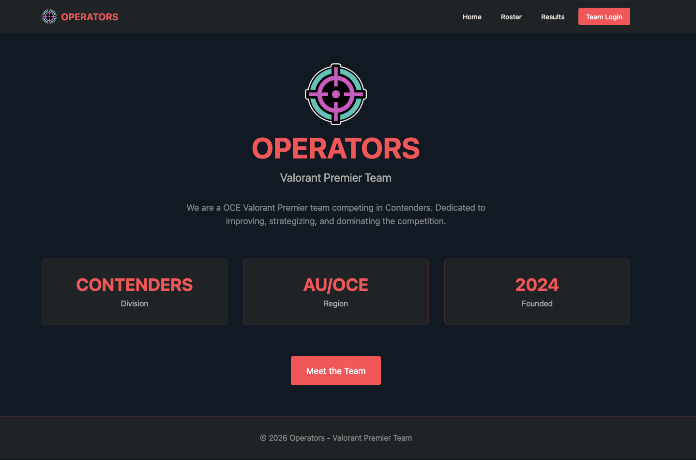
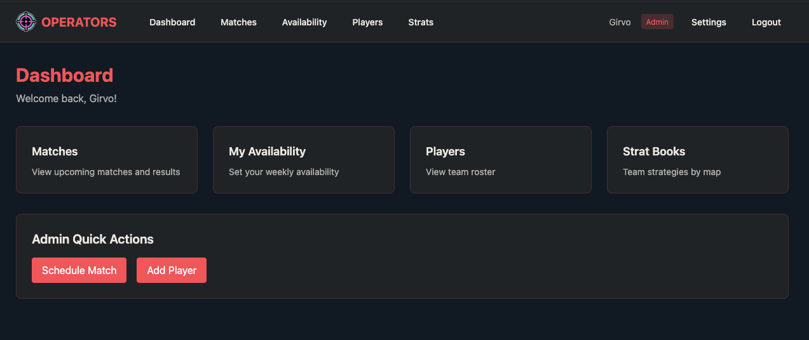
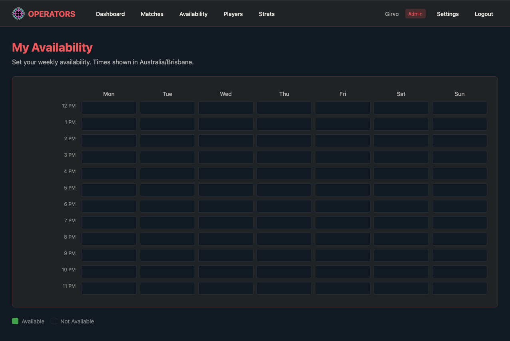

# Operators: Premier Team Manager

Team management app for Valorant Premier. Built with AdonisJS 6, HTMx, and Tailwind CSS.

## Features

<div align="center">
  <table border="0">
    <tr>
      <td valign="middle">
        <a href="./assets/home.png">
          
        </a>
      </td>
      <td valign="middle">
        <a href="./assets/dashboard.png">
          
        </a>
      </td>
      <td valign="middle">
        <a href="./assets/availability.png">
          
        </a>
      </td>
    </tr>
  </table>
</div>

- **Player Management** - Roster with player profiles, logos, and tracker.gg links
- **Availability Tracking** - Weekly availability grid with timezone support
- **Match Calendar** - Schedule scrims and officials, track results
- **Strat Books** - Map strategies with image uploads and Valoplant links
- **Public Pages** - Shareable roster and match results

## Tech Stack

AdonisJS 6, SQLite, HTMx, Tailwind

## Setup

```bash
# Install dependencies
pnpm install

# Copy env file and configure
cp .env.example .env

# Run migrations
mkdir tmp
node ace migration:run

# Seed database (creates admin user)
node ace db:seed

# Start dev server
pnpm dev
```

## Scripts

```bash
pnpm dev       # Start dev server with HMR
pnpm build     # Build for production
pnpm start     # Start production server
pnpm lint      # Run ESLint
pnpm typecheck # Run TypeScript checks
```

## License

MIT
